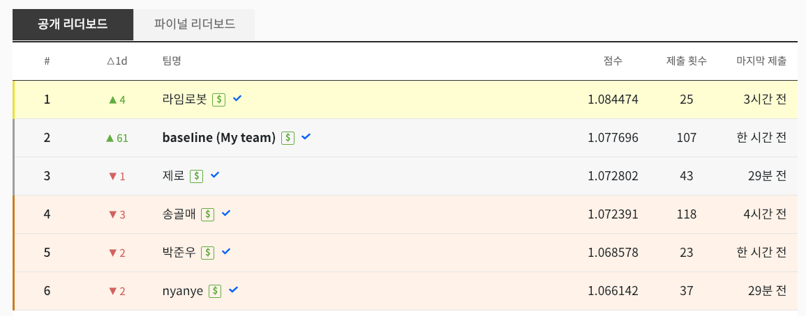

# Kakao Arena - Product Classification

Code for '[쇼핑몰 상품 카테고리 분류](https://arena.kakao.com/c/1)'

* Team: baseIine


**Public Leaderboard**(2019/01/07)




## Features

* Fully dockerized environment
* Input Pipeline
  * Tokenize product metadata with `Okt` [POS Tagger](http://konlpy.org/en/latest/api/konlpy.tag/#okt-class)
  * Use TFRecord
* 5 classifiers with 2-layer MLP
  * one for concatenated label of b,m,s,d
  * 4 classifiers for each category
* [Adversarial Training](https://github.com/tensorflow/models/tree/master/research/adversarial_text)


## Results

* The metric 'score' is calculated by the equation as follows:
  * score=(1.0 * b_acc + 1.2 * m_acc + 1.3 * s_acc + 1.4 * d_acc)
* The model **Final** was used to report our final results on dev, test
* Download trained weights [here](https://www.dropbox.com/sh/lgunvkfkij9xbse/AADUayUTY0xE4029Pumn1HKDa?dl=0)

| Model    | Dev score | Test score(TBD) | File Size |
| -------- | --------- | --------------- | --------- |
| Intermediate   | 1.07799 | -               | 966MB |
| Ensemble | 1.080755 | -               | 5*966MB |
| ***Final** | 1.077696 | -               | 966MB |


## Requirements

* Docker
* python >=2.7
  * Tensorflow >=1.12
  * Keras
  * Othres: h5py, tqdm, easydict
* Enough storage space at least 400GB


## Reproduce results

#### Setup

1. Download datasets from [kakao arena](https://arena.kakao.com/c/1/data)


#### Run a docker

```bash
$ bash build.sh
$ bash run.sh
```

**[Note]** Edit `DATA_PATH` from `run.sh`

For example,
```bash
ls $DATA_PATH
|- dev.chunk.01
|- test.chunk.01
|- test.chunk.02
|- train.chunk.01
|- train.chunk.02
|- train.chunk.03
|- train.chunk.04
|- train.chunk.05
|- train.chunk.06
|- train.chunk.07
|- train.chunk.08
`- train.chunk.09
```


#### Option1: Use pretrained weights

1. Download weights [Dropbox Link](https://www.dropbox.com/sh/lgunvkfkij9xbse/AADUayUTY0xE4029Pumn1HKDa?dl=0)
2. Copy weights to `/data/output/interim`, `/data/output/final`

```bash
$ bash scripts/eval.sh 0 interim 70 # for validation
$ bash scripts/inference.sh 0 interim 70 dev # for submission
$ bash scripts/inference.sh 0 interim 70 test # for submission

$ bash scripts/inference.sh 0 final 12 dev # for submission
$ bash scripts/inference.sh 0 final 12 test # for submission
```


#### Option2: Train a model from scratch

```bash
$ bash reproduce.sh
```

#### 

## Reference

1. [Baseline code](https://github.com/kakao-arena/shopping-classification)
2. [KoNLPy: Korean natural language processing in Python](http://konlpy.org/en/latest)
3. [Adversarial Training](https://github.com/tensorflow/models/tree/master/research/adversarial_text)


## License

© [Taekmin Kim](https://www.linkedin.com/in/taekminkim/), 2019. Licensed under the [MIT](LICENSE) License.
